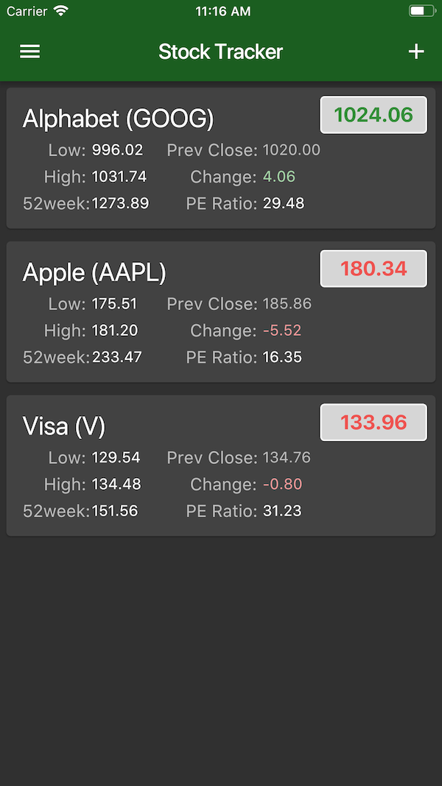

# stock_tracker

Flutter app to track stocks for multiple users, using Cloud Firestore on the backend.

## Overview

I wrote this Flutter application as a means to learn [Flutter](http://flutter.io), [Dart](https://www.dartlang.org/guides/language) and [Firebase](https://firebase.google.com).

The entire application is about 1200 lines of code, including comments. The same code base for this app (with no changes) runs as a native app on iOS and Android.

### Application Features:

▪ Support multiple users.  
▪ Create authenticated user accounts on a remote server.  
▪ When logged in, view stats for stocks you’ve selected.  
▪ Add/delete stocks.  
▪ Keep the backend and mobile application data synced.  
▪ Support offline mode.  
▪ Call remote APIs.  
▪ Serialize and deserialize JSON.  

Here is a screenshot of the main view in the application:

Watch a video walkthrough of the application: [iOS Dev’s First Flutter App](https://youtu.be/8j3I_dp4Ac0).

## Running the application

In order to run this project, you will need to configure Firebase with your account information. 

If you are not familiar with this process, [Andrea Bizzotto](https://twitter.com/biz84) does a nice walkthrough in his video on 
[Flutter & Firebase Authentication](https://youtu.be/BNOUtPSN-kA). The specific steps begin around [12:20 into the video](https://www.youtube.com/watch?v=BNOUtPSN-kA&feature=youtu.be&t=738).

## Caveats

Given I am new to Dart/Flutter, I can't promise the source code is efficient and/or well structured. Feedback is welcome.

Also, for my own benefit while learning Flutter, I've added many comments to the code. I personally found this helpful (and added to the readability). Your mileage may vary.
